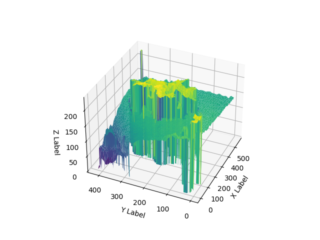

# 🍓 Strawberry Canopy Volume Estimation — LiDAR + Computer Vision

**University of Florida · Agricultural and Biological Engineering · Precision Agriculture Lab**  
**Author:** Shiyu Liu &nbsp;|&nbsp; **Duration:** Sep 2023 – Feb 2024

---

## Project Overview

This research project develops a multi-modal sensing pipeline to **estimate greenhouse strawberry canopy volume**, combining:

- **Hokuyo UTM-30LX 2D LiDAR** integrated with **ROS 2** for 3D spatial mapping via SLAM
- **RGB-D depth camera** for per-plant depth and height data collection
- **Computer vision** (OpenCV) for edge detection, image segmentation, and area computation
- **DJI drone video** processing for field-scale canopy analysis

Canopy volume serves as a proxy for plant health, biomass, and growth stage — enabling data-driven decisions in precision agriculture.



---

## Repository Structure

```
├── ros2-ws/                        # ROS 2 workspace — LiDAR driver & SLAM packages (C++/CMake)
├── cv-analysis/                    # Python scripts & Jupyter notebooks for image processing
│   ├── ImageProcessing_EdgeDetect.ipynb   # Canny edge detection on depth images
│   ├── labelme2area.ipynb                 # LabelMe annotation → polygon area (Shoelace formula)
│   ├── imageshow.ipynb                    # 2D/3D depth data visualization
│   ├── readdata.py                        # Load & fuse .npy depth + height arrays
│   └── Videoconvert2image.py             # Extract frames from DJI drone video
├── docs/                           # Setup guides (see below)
├── assets/                         # Figures and result images
├── bi-weekly-report/               # Research progress reports (6 reports, Sep 2023 – Feb 2024)
├── .gitignore
└── README.md
```

> **Note:** The `docs/` folder contains setup instructions originally written in Apple Pages format.
> See the [LiDAR Setup Guide](#lidar--ros-2-setup) section below for the key steps.

---

## Hardware & Software Stack

| Component | Details |
|-----------|---------|
| LiDAR | Hokuyo UTM-30LX (2D, 270° FOV, 0.1–30m range, 40Hz) |
| Depth Camera | Intel RealSense (RGB-D, 420×560 resolution) |
| Drone | DJI (field video collection) |
| OS / Framework | Ubuntu 22.04 · ROS 2 Humble |
| SLAM | Cartographer (working), Rtabmap (experimental) |
| Languages | Python 3 · C++ · CMake · Shell |
| Key Libraries | OpenCV · NumPy · Matplotlib · PIL · `urg_node2` |
| Annotation Tool | LabelMe |
| Point Cloud Viewer | CloudCompare · RViz2 |
| Data Formats | `.npy` · `rosbag2 (.db3)` · JPEG |

---

## Methods

### 1. LiDAR Data Acquisition & SLAM (ROS 2)

The Hokuyo UTM-30LX is connected via USB and driven by the `urg_node2` ROS 2 package.
Two SLAM approaches were evaluated:

- **Cartographer** — Successfully generated occupancy maps of the lab environment. Resolution was too coarse for individual plant-level detail.
- **Rtabmap** — Set up and tested; map generation encountered configuration issues (see `docs/rtabmap_install_failed`).

Next step: convert `rosbag2` `.db3` data to ASCII / PCD format for import into **CloudCompare** for full 3D point cloud visualization, following the approach of [Llop et al., 2016].

### 2. Depth Camera Data Processing

RGB-D images were collected from strawberry rows. Each scan produces:
- `*ColorImage.jpg` — RGB frame
- `*DepthData.npy` — per-pixel depth array (420×560)
- `*HightData.npy` — per-pixel height array (420×560)

`readdata.py` fuses depth and height arrays to compute total height distribution per pixel.
`imageshow.ipynb` provides 2D heatmap and 3D surface visualizations of the depth data.

### 3. Edge Detection & Contour Area (OpenCV)

`ImageProcessing_EdgeDetect.ipynb` applies Canny edge detection to identify canopy boundaries:

- **Threshold selection:** Otsu's binarization (auto) vs. median-based (adaptive). Otsu performed better.
- **Contour finding:** `cv2.findContours` → `cv2.contourArea` for pixel-level area
- **Noise removal:** Connected component filtering (removes components < 6 pixels)
- **Finding:** Canny on grayscale works well for white flowers/fruits but struggles to distinguish green leaves from background. RGB-space or HSV masking is recommended as a follow-up.

### 4. Manual Segmentation → Area (LabelMe)

`labelme2area.ipynb` processes LabelMe polygon annotations:
- Reads JSON annotation files
- Computes polygon area using the **Shoelace formula** (Green's theorem)
- Result on sample image: ~108,318 px² canopy cross-section

### 5. Drone Video Processing

`Videoconvert2image.py` extracts all frames from DJI field video using OpenCV's `VideoCapture`, saving each as a numbered JPEG for downstream analysis.

---

## LiDAR + ROS 2 Setup

> Full bilingual setup guide originally in `docs/Lidar_instruction_English.pages`.

```bash
# 1. Install ROS 2 Humble (Ubuntu 22.04)
# https://docs.ros.org/en/humble/Installation.html

# 2. Install urg_node2 LiDAR driver
sudo apt install ros-humble-urg-node2

# 3. Connect Hokuyo UTM-30LX via USB, then launch
ros2 launch urg_node2 urg_node2.launch.py

# 4. Verify LiDAR scan data is publishing
ros2 topic echo /scan

# 5. Launch Cartographer SLAM
ros2 launch cartographer_ros demo_backpack_2d.launch.py
```

For `rosbag2` recording:
```bash
ros2 bag record /scan
```

---

## Python Environment Setup

```bash
pip install numpy opencv-python matplotlib pillow jupyter
```

Run any notebook:
```bash
cd cv-analysis
jupyter notebook ImageProcessing_EdgeDetect.ipynb
```

---

## Results Summary

| Task | Result |
|------|--------|
| LiDAR + ROS 2 connection | ✅ Verified, `/scan` topic publishing |
| Cartographer SLAM | ✅ Lab-scale map generated |
| Rtabmap SLAM | ⚠️ Setup complete, map quality insufficient |
| Canny edge detection | ✅ Working; Otsu threshold optimal |
| LabelMe area estimation | ✅ ~108,318 px² on sample image |
| 3D point cloud (CloudCompare) | 🔄 In progress (data format conversion needed) |

---

## References

- Llop, J. et al. (2016). Testing the Suitability of a Terrestrial 2D LiDAR Scanner for Canopy Characterization of Greenhouse Tomato Crops. *Sensors*, 16(9), 1435. https://doi.org/10.3390/s16091435
- [Hokuyo UTM-30LX](https://www.hokuyo-aut.jp/)
- [ROS 2 urg_node2](https://github.com/Hokuyo-aut/urg_node2)
- [Google Cartographer ROS](https://google-cartographer-ros.readthedocs.io/)
- [LabelMe Annotation Tool](https://github.com/wkentaro/labelme)

---

## Future Work

- Convert `rosbag2` `.db3` → PCD/ASCII for CloudCompare 3D visualization
- Replace grayscale Canny with HSV color masking for better leaf segmentation
- Fuse LiDAR scan + depth camera data for volumetric (3D) canopy estimation
- Automate full pipeline: raw sensor data → canopy volume number

---

*Precision Agriculture Laboratory · Agricultural and Biological Engineering · University of Florida*
